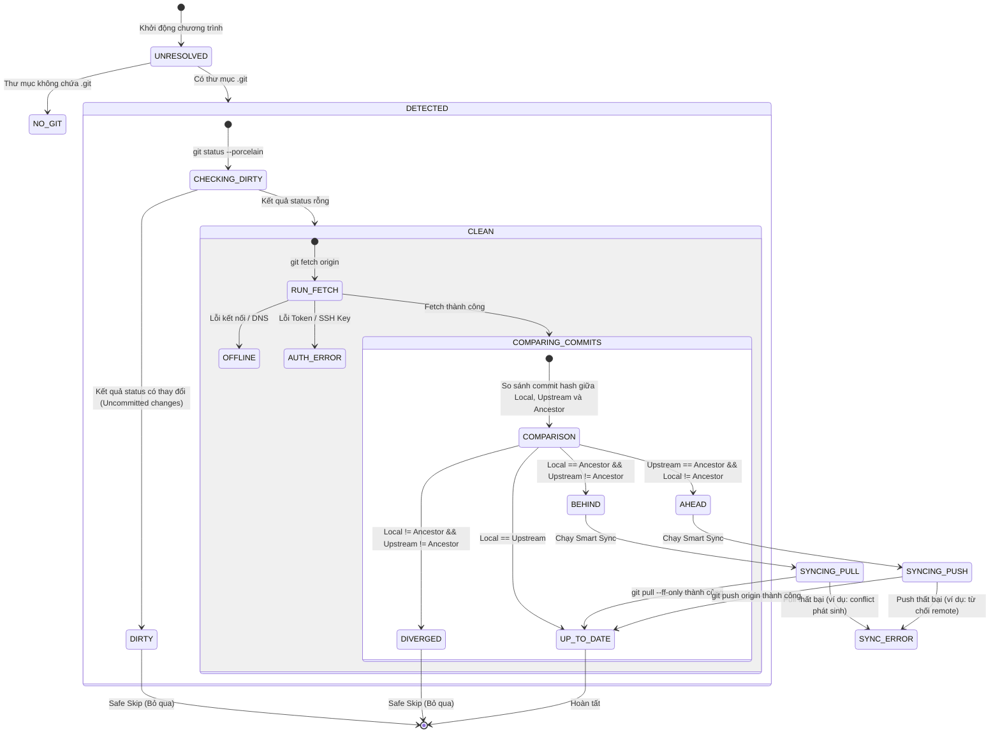
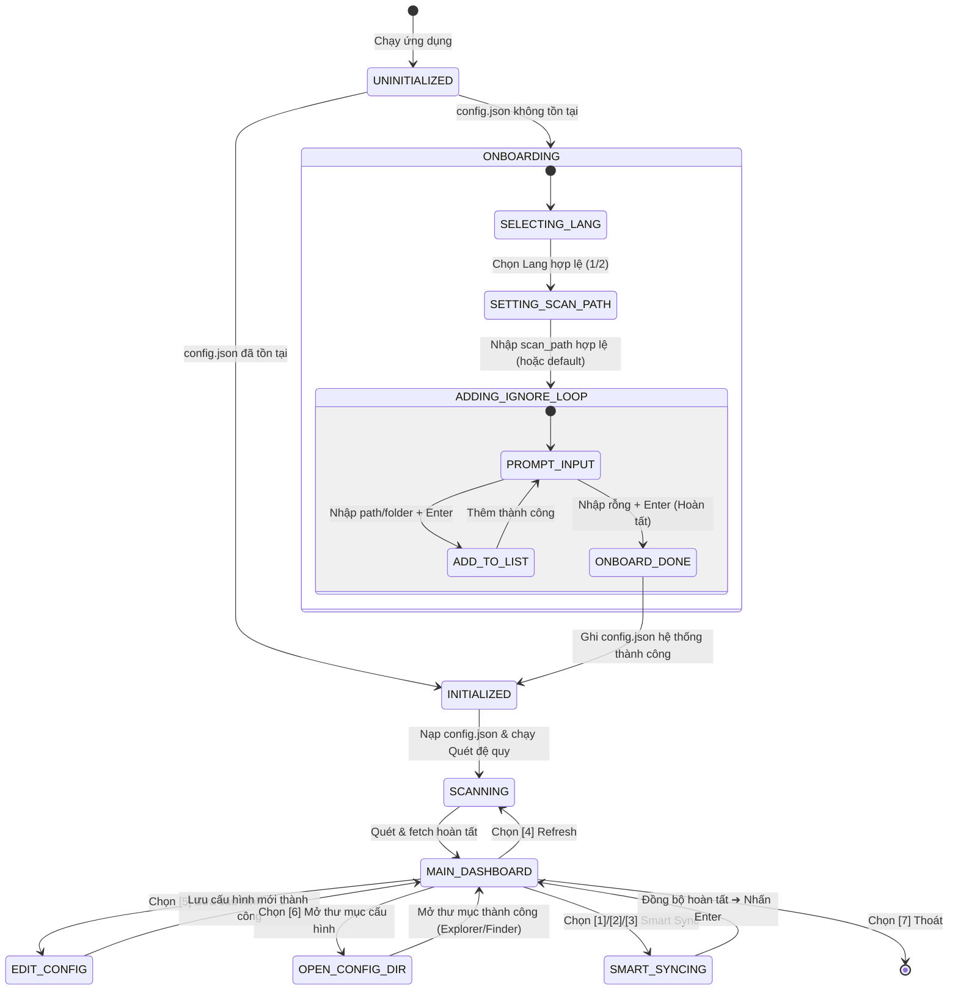

# Feature Flow Specification: Git Multi-Sync Tool (`_spec2_feature_flow`)

> **Version:** 1.0.0  
> **Last Updated:** 2026-08-10  
> **Target Audience:** Lead Developer, Dev Agent, QA/Test Agent  

---

## 1. Biểu đồ Chuyển đổi Trạng thái (Sync State Machine Diagram)

Mỗi repository con khi được quét qua chương trình sẽ trải qua các chuyển đổi trạng thái dựa trên các lệnh Git kiểm tra và hành động đồng bộ:



---

## 2. Luồng Logic Kiểm tra Trạng thái Chi tiết (Inspection Logic Flow)

Khi phân tích một thư mục con `repo_path`, Sync Engine thực hiện chuỗi lệnh subprocess sau:

### Bước 1: Kiểm tra xem lệnh `git` hệ thống có khả dụng hay không
Nếu không, đặt trạng thái hệ thống là `NO_GIT` toàn cục.

### Bước 2: Kiểm tra thư mục con có phải Git Repo không
Kiểm tra sự tồn tại của thư mục `repo_path / ".git"`.
- Nếu không tồn tại: Ghi nhận trạng thái `NO_GIT` cho thư mục đó và bỏ qua.

### Bước 3: Kiểm tra Working Tree (`git status --porcelain`)
Chạy lệnh:
```bash
git status --porcelain
```
- Nếu đầu ra **không rỗng**: Ghi nhận trạng thái `DIRTY` (dù repo có Ahead hay Behind, việc Dirty sẽ chặn mọi hành vi Sync tự động). Lưu danh sách các file dirty vào log.
- Nếu đầu ra **rỗng**: Tiếp tục sang Bước 4.

### Bước 4: Lấy thông tin Branch hiện tại và Upstream Remote
Chạy lệnh:
```bash
git rev-parse --abbrev-ref HEAD
```
Đầu ra trả về tên branch hiện hành (ví dụ: `main`).

Kiểm tra xem branch này có được liên kết với remote branch không bằng cách chạy:
```bash
git rev-parse --abbrev-ref HEAD@{u}
```
- Nếu lệnh lỗi (exit code != 0): Ghi nhận trạng thái `NO_REMOTE` (không có remote upstream cho nhánh này).
- Nếu thành công: Trả về tên nhánh remote (ví dụ: `origin/main`). Tiếp tục sang Bước 5.

### Bước 5: Chạy Fetch ngầm (`git fetch origin`)
Chạy lệnh fetch để cập nhật danh sách commit từ remote repo:
```bash
git fetch origin
```
- Nếu lỗi với mã lỗi kết nối mạng (ví dụ: `Could not resolve host`): Ghi nhận trạng thái `OFFLINE` cho repo đó.
- Nếu lỗi xác thực (ví dụ: `Permission denied (publickey)`): Ghi nhận trạng thái `AUTH_ERROR`.
- Nếu thành công: Tiếp tục sang Bước 6.

### Bước 6: So sánh Commits
Lấy mã băm Commit của 3 mốc:
1. **Local Commit Hash (`@`):**
   ```bash
   git rev-parse @
   ```
2. **Upstream Commit Hash (`@{u}`):**
   ```bash
   git rev-parse @{u}
   ```
3. **Common Ancestor Commit Hash (`merge-base`):**
   ```bash
   git merge-base @ @{u}
   ```

So sánh các giá trị băm (Hash string):
- **Local == Upstream**: Trạng thái **`UP_TO_DATE`**.
- **Local == Ancestor** và **Upstream != Ancestor**: Trạng thái **`BEHIND`** (Local đang bị chậm hơn Remote, có thể Fast-Forward pull).
- **Upstream == Ancestor** và **Local != Ancestor**: Trạng thái **`AHEAD`** (Local đang chạy trước Remote, có thể Push).
- **Local != Ancestor** và **Upstream != Ancestor**: Trạng thái **`DIVERGED`** (Cả Local và Remote đều có commit mới riêng, cần Merge tay).

---

## 1.1. Sơ đồ Trạng thái của Ứng dụng CLI (Application State Machine)

Bên cạnh trạng thái của từng repo, toàn bộ vòng đời hoạt động của ứng dụng CLI `git_sync` chuyển đổi qua các trạng thái hệ thống chính sau:



---

## 2.1. Luồng Logic Thiết lập Ban đầu (Interactive Onboarding Logic Flow)

Khi phát hiện tệp `config.json` hệ thống không tồn tại, Sync Engine kích hoạt chuỗi xử lý tương tác sau:

### Bước 1: Chọn ngôn ngữ (Language Selection)
- In câu hỏi chào mừng bằng cả hai ngôn ngữ: `Tiếng Việt` và `English`.
- Đọc đầu vào:
  - Nếu nhập `1` ➔ Cấu hình `lang = "en"`.
  - Nếu nhập `2` ➔ Cấu hình `lang = "vi"`.
  - Nếu nhập các giá trị khác ➔ In thông báo lỗi song ngữ và yêu cầu nhập lại.

### Bước 2: Nhập thư mục quét (Scan Path Setup)
- Hiển thị thông báo yêu cầu nhập đường dẫn tuyệt đối (Workspace).
- In kèm gợi ý thư mục hiện tại của tiến trình (`Path.cwd()`).
- Đọc đầu vào:
  - Nếu đầu vào là rỗng (người dùng nhấn Enter trực tiếp) ➔ Gán `scan_path = Path.cwd()`.
  - Nếu người dùng nhập đường dẫn ➔ Thực hiện kiểm tra `Path(input_path).exists()`. Nếu không tồn tại, hiển thị thông báo lỗi đỏ và yêu cầu nhập lại. Nếu tồn tại, gán `scan_path = Path(input_path)`.

### Bước 3: Vòng lặp thêm ignore (Ignore List Interactive Loop)
Hệ thống sử dụng một danh sách tạm thời `temp_ignore = ["node_modules", "venv", ".venv", "build", "dist"]`:
1.  **Hiển thị danh sách hiện hành:** In ra màn hình console danh sách `temp_ignore` đã có dạng: `[DANH SÁCH BỎ QUA HIỆN TẠI]: ["node_modules", "venv", ".venv", "build", "dist"]`.
2.  **Nhắc người dùng nhập:** In câu hỏi *"Nhập tên thư mục hoặc đường dẫn cần bỏ qua tiếp theo (Nhấn Enter trực tiếp để Hoàn tất):"*.
3.  **Đọc đầu vào:**
    -   **Nếu đầu vào RỖNG (chỉ nhấn Enter):** Thoát vòng lặp ➔ Chuyển tiếp sang Bước 4.
    -   **Nếu đầu vào KHÔNG RỖNG:** 
        -   Cắt bỏ khoảng trắng thừa (`strip()`).
        -   Nếu giá trị nhập chưa có trong danh sách ➔ Thêm vào `temp_ignore`.
        -   In ra thông báo `[Đã thêm vào danh sách bỏ qua]`.
        -   Quay lại Bước 3.1.

### Bước 4: Lưu cấu hình & Chuyển tiếp
- Khởi tạo các giá trị mặc định cho cấu hình hệ thống:
  - `max_depth = 3`
  - `timeout = 10`
  - `max_concurrency = 8`
- Tạo thư mục Application Support/AppData hệ thống: `Path(config_path).parent.mkdir(parents=True, exist_ok=True)`.
- Ghi đè file `config.json` với định dạng JSON chuẩn.
- In ra thông báo thành công: `[INFO] Cấu hình Onboarding hoàn tất! Đang vào Dashboard...`.
- Gọi hàm Quét & Fetch ban đầu và chuyển tiếp người dùng trực tiếp vào Menu Dashboard chính.

---

## 3. Thuật toán quét đệ quy tìm Git Repos (Recursive Scan Algorithm)

Trước khi thực hiện kiểm tra trạng thái song song, Sync Engine thực hiện quét đệ quy từ thư mục gốc `scan_path` để định dạng danh sách Git Repositories con:

### Các bước của thuật toán (DFS Traversal):
1. **Đầu vào:** Thư mục hiện tại `current_dir` và độ sâu hiện tại `current_depth` (bắt đầu từ `0`).
2. **Kiểm tra giới hạn & Bỏ qua:** 
   - Nếu `current_depth > max_depth` (giá trị cấu hình trong config, mặc định là 3) ➔ Dừng đệ quy tại nhánh này.
   - Nếu tên thư mục của `current_dir` nằm trong danh sách ignore mặc định (ví dụ: `.git`, `node_modules`, `venv`...) hoặc danh sách ignore tùy chọn từ file cấu hình (`ignore_list`) ➔ Dừng đệ quy tại nhánh này.
3. **Phát hiện Git Repo:**
   - Kiểm tra xem thư mục `current_dir / ".git"` có tồn tại hay không.
   - **Nếu có:** Thêm `current_dir` vào danh sách Repos cần xử lý và **dừng đệ quy sâu hơn** (để tránh phát hiện submodule hoặc cache cục bộ).
   - **Nếu không:** Tiếp tục duyệt qua tất cả các thư mục con trực thuộc `current_dir` và thực hiện đệ quy với `current_depth + 1`.

---

## 4. Quy trình Chạy song song (Async Scan Execution Flow)

Để tránh việc quét tuần tự từng Repo làm treo ứng dụng và tốn thời gian, Sync Engine sử dụng lập trình bất đồng bộ:

```text
               ┌──────────────────────────────┐
               │    Start: Async Inspect      │
               └──────────────┬───────────────┘
                              │
                  [Chạy Quét đệ quy tìm Repos]
                    (DFS: max_depth = 3)
                              │
                    [Tạo list tasks chạy]
            For each repo: async_inspect_task(repo)
                              │
                    ┌─────────┴─────────┐
                    ▼                   ▼
             [Inspect Repo 1]    [Inspect Repo 2]  ... (Chạy song song)
                    │                   │
                    └─────────┬─────────┘
                              │
                     [asyncio.gather()]
                              │
               ┌──────────────▼───────────────┐
               │     Gom kết quả & In bảng    │
               └──────────────────────────────┘
```

*   **Semaphore limit:** Sử dụng `asyncio.Semaphore(max_concurrency)` giới hạn tối đa số tác vụ kiểm tra cùng chạy một lúc (cấu hình trong `config.json`, mặc định là 8) để tránh nghẽn băng thông mạng hoặc bị Git server từ chối kết nối.
